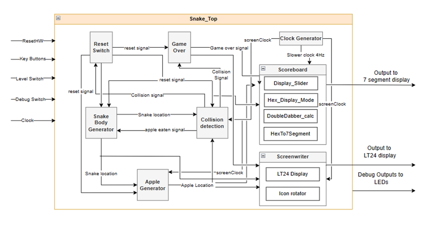
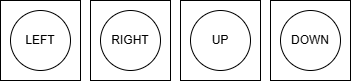
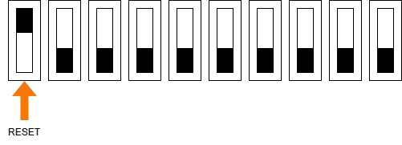
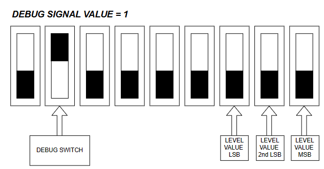
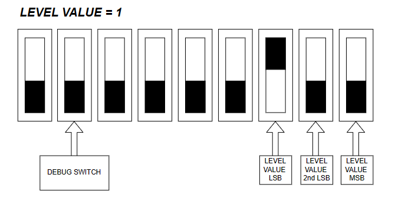
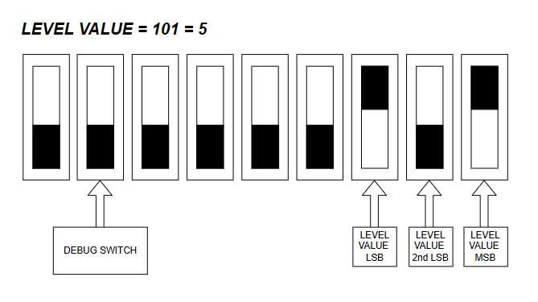

## Project Description
This repository contains the files for implementing the game snake in verilog HDL written and tested using Intel Quartus Prime Design Suite. This was done for the group assessment for ELEC5566M at the University Of Leeds. The code is full modularised and parametrised to improve code readability. This read me first will take you through the files in the repository their description and location. Followed by a detailed description of each file and concludes with a user instruction manual

| Location | File | Purpose |
| ---  | --- | --- |
| `Snake_Top.v`  | `Snake_Top.v` | The top level module for the snake game |
| `simulation/Snake_Top_tb.v` | `Snake_Top_tb.v` | Synchronous test bench file for the top level module |
| `Direction.v`     | `Direction.v`     | Submodule used for mapping user key input to snake direction |
| `simulation/Direction_tb.v` | `Direction_tb.v`       | Test bench file for Direction module |
| `Apple_Gen.v`     | `Apple_Gen.v`     | Submodule used for generating apple in a random on the board |
| `simulation/Apple_Gen_tb.v` | `Apple_Gen_tb.v`       | Test bench file for Apple Generator module |
| `GameOver.v`     | `GameOver.v`     | Submodule used for Finite State Machine to describe gameover mechanism |
| `simulation/GameOver_tb.v` | `GameOver_tb.v`       | Test bench file for Game Over module |
| `Collision_Detector.v`     | `Collision_Detector.v`     | Submodule used for detecting whether the snake head has collided with either and apple, its own body or barrier|
| `simulation/Collision_Detector_tb.v` | `Collision_Detector_tb.v`       | Test bench file for Collision_Detector |
| `Snake.v` | `Snake.v` | Generates the snake body coordinates and updates it every screen refresh cycle |
| `simulation/Snake_tb.v` | `Snake_tb.v` | Test bench file for the snake module |
| `Scoreboard.v` | `Scoreboard.v` | Submodule to display relevant details on the seven-segment display |
| `simulation/Scoreboard_tb.v` | `Scoreboard_tb.v` | Test bench file for the scoreboard module |
| `Display_Slider.v` | `Display_Slider.v` | Submodule of the Scoreboard module for scrolling display functionality |
| ` Hex_Display_Mode.v` | `Hex_Display_Mode.v` | Submodule having a moor type state machine for assiging 3 display modes on the seven-segment display|
| `DoubleDabber_calc.v` | `DoubleDabber_calc.v` | A submodule to Scoreboard.v and a BCD converter module based on DoubleDabble algorithm for display on 7-Segment (Taken from Unit 3 lab task) |
| `Shifter.v` | `Shifter.v` | Submodule to DoubleDabber_calc.v for performing the double dabble algorithm for BCD conversion. (Taken from Unit 3 lab task) |
| `HexTo7Segment.v` | `HexTo7Segment.v` | Submodule to Scoreboard.v and does hex to 7 segment conversion (taken from Unit 1 lab tasks) | 
| `Clock_Generator.v` | `Clock_Generator.v` | Module for generation of slower clock for screen refresh and scrolling display speed |
| `simulation/Clock_Generator_tb.v` | `Clock_Generator_tb.v` | Test bench file for the clock generator module |
| `Tom_Screen_Writer/ScreenWriter.v` | `ScreenWriter.v` | Module which interfaces with the LT24 display |
| `ScreenWriter_tb.v` | `ScreenWriter_tb.v` | Testbench module for the screen writer |
| `Tom_Reset_Switch/ResetSwitch.v` | `ResetSwitch.v` | Mapping and debouncing hardware reset signal into software |
| `reset_switch_tb` | `reset_switch_tb.v` | Testbench module for the reset switch |
| `icon_rotator.v` | `icon_rotator.v` | Module for displaying each of the snake head rotations based on direction |
| `icon_rotator_tb.v` | `icon_rotator_tb.v` | Testbecnh module for the icon rotator |

## Detailed File Description
### Top Level Module

This is the top module of the snake game. For achieving the functionality, this module instantiates all the sub modules as per the functional block diagram shown in below figure.
  
 Inputs:
 * 4 Key buttons for changing snake direction of motion
 * Sliding Switch 0, 1 and 2 for indicating game level
 * Sliding Switch 9 for hard reset 
 * Sliding Switch 8 for activating debug display mode
 * 50MHz internal clock of the DE1 SoC board
 
 Outputs:
 * LEDs display indicating critical signals for debugging
 * 7 segment displays from seg0 to seg 5
 * LT24 display outputs

 
### Direction.v
The direction submodule maps user inputs from pressing keys 0, 1, 2, 3 on the board to the snakes direction of travel: down, up, right and left respectively. It takes as input 1-bit signals reset and clock as well as 4-bit keysHW which are the inputs from the board keys and outputs 4-bit direction corresponding to the users desired direction of travel.

| Inputs | Outputs |
| ---  | --- |
| keysHW = 1110 | direction =  0001 (LEFT) |
| keysHW = 1011 | direction =  0100 (RIGHT) |

### Direction_tb.v
This testbench exhaustively tests all possible inputs into the direction module. It tests that the snake can go from its default no movent to all directions. It checks that the snake direction cant be accidently reversed into itself i.e if it moving forwards, the snake wont go backwards if the user pressed back button. It checks that all directions apart from reversing directions can be achieved from any direction.

It takes as input 1 bit clock, 1 bit reset and 4 bit key input. It outputs a 4 bit reg called direction which is the direction snake should move in based on user KEY pressing input
 
Thank you to Renwentai Zhou who greatly helped develop the code for simulating a clock in a testbench during class Lab sessions and the same code snippet has been used here.

### Collision_Detector.v
The collision detection module determines whether the snake head has had a gameover collision such as with the game boundary walls or its own body and positive collisions with an apple. It takes as input snakeLocX, snakeLocY, size, appleLocX, appleLocY, clock, screenClock and reset and outputs a 1 bit reg’s appleEaten and collision which act as flags for the other modules to inform of the type of collision.

### Collision_Detector_tb.v
This testbench conducts full exhaustive testing to ensure the submodule was robust and could handle full/partial overlap, glance collisions (1 pixel overlap) and glance misses in all orientations. Thank you to Renwentai Zhou who greatly helped develop the code for simulating a clock in a testbench during class Lab sessions and the same code snippet was used in the testbench.

### Apple_Gen.v
Generates apple in the start at a default location, generates it a random place if apple eaten is high. Thank you Sebastian Cheshire for writing the snake body array unpacking code, the same code was used in the module 

### Apple_Gen_tb.v
Test Bench to check apple spawnsin the start at a default location and at a random place if apple eaten is high.

### GameOver.v
Determines if the game is over and switches to reset state

### GameOver_tb.v
Checks the transition between different states and outputs a collison bit high

### Snake.v
This module takes clock, reset, Screen refresh rate, and snake direction as inputs and generates the xy coordinates of the snake as the output
### Snake_tb.v
This module tests the functionality of the Snake module for different input combinations of direction and appleEaten. Both clock and screenclock inputs are inverted at different cycles. The screenclock cycles were used to check if the snake coordinates are changing according the correct direction input and clock cycles were used to update the size from the appleEaten input. 
### Scoreboard.v
This module takes clock, a display refresh clock, size, apple locations, a debug switch, level indication, game over, and reset signals as inputs. Generates a scrolling display with three different modes depending on the state of the game and user requirement. An additional feature is integration of a debugging mode wheredesired values (in this condition appleLocX and Y) are displayed on the board. This module uses a Finite State Machine to determine the desired display mode.
#### (i) Display_Slider.v
This module takes clock, reset, and a register with size based on the parameter VarLength as input. The name of the register is allVals and denotes the sentence to be printed on the seven-segment display. In every clock cycle, the module outputs 6 7-bit wide registers to be displayed on the seven-segment display. To achieve the functionality of a scrolling display, the module shifts allVals by 7 bits  and uses a temporary register to store the values in it. The most significant 42 bits of the temporary register are the assigned to the output.
#### (ii) Hex_Display_Mode.v
This module takes gameover, debug switch inputs and deploys an FSM to decide the output to the 7 segment display.
#### (iii) HexTo7Segment.v 
This module takes a 4-bit binary number as input and converts it into a seven segment display format as a 7-bit output.

#### (iv) DoubleDabber_calc.v
This module converts an N-bit input to Binary Coded Decimal format using double dabble algorithm.
#### (v) Shifter.v
This module does one cycle of the shifting operation in a double dabble algorithm to convert one N-bit binary number to BCD format.

### Scoreboard_tb.v
This module tests the functionality of the Scoreboard module for different input combinations of level, size, debugMode, gameOver signals in a synchronous mode where screenClock cycle time period is 6250 times that of the clock signal. In the DE1Soc board, the clock has 50MHz frequency and the screenClock has a lower frequency of 4Hz. However, the test methodology used in this test bench will work to simulate same functionality with a lower simulation time.

### Clock_Generator.v
This module generates clock signals with the default input 50MHz clock Output as slower clock depending on the parameter input.
### Clock_Generator_tb.v
This is a test bench module to check the functionality of the clock generator module. The clock signal will be varied for 100x10^6 clock cycles to capture generation of the output clock signal for different values of level.

### icon_rotator.v
This module instaniates the 4 rotations of the snake head icon, and outputs the respective pixelData based on the current direction the snake is travelling in, such that the head of the snake always points in the direction of travel.

### icon_rotator_tb.v
A simple testbench for the icon rotator module

### ScreenWriter.v
This module instaniates the LT24 display IP and iterfaces directly to the LT24 hardware. Additionally this module determines the pixelData which should be outputted to each pxiel on the screen, this is done through combinatorial logic and 1-port RAM memory IPs for images

### ScreenWriter_tb.v
A simple testbench for the screen writer module
 
### ResetSwitch.v
This module accesses the pin-assigned signal from the hadware reset (SW9) on the DE1 board: When the slider is toggled from one state to anohter, a single reset pulse will go high for one clock cycle

### reset_switch_tb.v
A simple testbench for the reset switch module

## User Manual
You play as a very hungry snake who has a taste for apples, so hungry infact that you cannot stop moving, eat as many as you can without crashing into yourself or the walls!
Every apple you eat will grow the snake by 2 units, so the board will quickly become overcrowded, try to plan your path ahead to ensure you have space to move!

The game is played with the 4 push-buttons on the front face of the DE1 board, the commands of the buttons are:

Note that these buttons will only direct the snake as long as the direction change is valid. For example you cannot move down if you are already travelling upwards, as this will immediatly kill the snake.

To reset the game at any point simply toggle the status of the left-most switch (SW9)

SW9 can be switched UP->DOWN or DOWN->UP to trigger a reset event

Additional functionalities include a debug switch from Sliding Switch 8 to enable debug mode in the seven segment display and different speed levels based on Sliding Switches 0, 1 and 2 as shown in below images.

